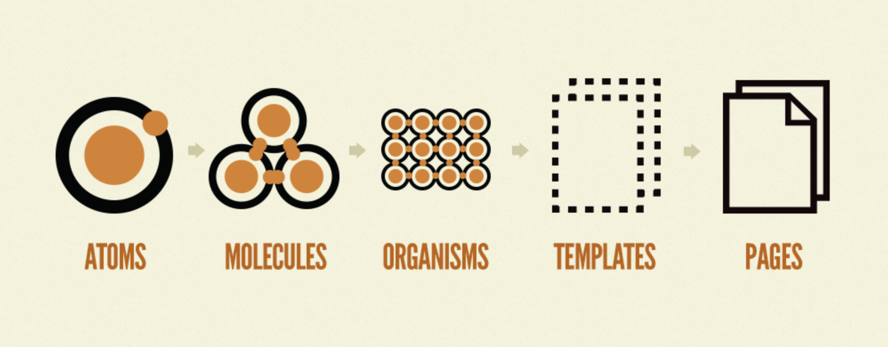

# @/ai/generated folder

Generating code is a common pattern is software development. For Instance, if you have a database schema, you can generate code to access the database. If you had an Swagger spec you could generate typescript types or a client SDK. Traditionally, this would be one using some kind of codemod script may output into a directory named `src/generated`.

If you are generating code using an LLM for use in your application it is best practice to put your generated code into a [`src/ai/generated`](https://github.com/BLamy/GPT-AccessControl/tree/main/src/ai/generated) folder. This will allow you to import the generated code into your typesafe prompts.

## Embedding generated code in prompts

Sometimes it will be useful to embed AI generated code into one of your prompts.

For instance, if you were building an access control system, you could use GPT to generate a set of rules from a set of user stories or requirements.

You can embed generated code into your typesafe prompts like this.

```typescript
const prompt = `You previous wrote to your scratchpad:
\`\`\`json
${JSON.stringify(require('@/ai/generated/Rules'))}
\`\`\` 
` as const;
export type Prompt = typeof prompt;
```

The build step will replace the require statements in the generated code directory with the literal text of the generated code.

## Best practices for generated code

### Using github issues to trigger code generation

You can take advantage of [github issue templates](https://docs.github.com/en/communities/using-templates-to-encourage-useful-issues-and-pull-requests/configuring-issue-templates-for-your-repository#creating-issue-forms) to create forms that trigger code generation.



<figure><figcaption></figcaption></figure>



```javascript
name: Change Rules Form
description: Fill out this form to submit a PR with modified rules
title: "[RuleChange]: "
labels: ["rule-change"]
body:
- type: input
  id: username
  attributes:
    label: Username
    description: Enter your username
    placeholder: ex. octocat
  validations:
    required: true
- type: dropdown
  id: role
  attributes:
    label: Role
    description: Select your role
    options:
    - public
    - admin
    - employee
  validations:
    required: true
- type: dropdown
  id: action
  attributes:
    label: Action
    description: Select the action you want to perform
    options:
    - public
    - confidential
    - non_confidential
  validations:
    required: true
```



### Use a schema to validate the generated code

When generating code, it is best practice to use a schema to validate the generated code.

For instance, if you were generating a set of rules for an access control system, you could use a zod schema to validate the rules. If GPT ever outputs something that doesn't fit this format you can feed the error back into GPT for reflection.

```typescript
import { z } from 'zod';

export const rulesSchema = z.object({
    roles: z.array(z.string()),
    actions: z.array(z.string()),
    rules: z.array(z.object({
        role: z.string(),
        action: z.string(),
        decision: z.boolean(),
    })),
});
```

### Use automated test to validate generated code

Running a test suite can also be used to create guardrails for the code GPT is generating. In my experience test are best run on PR creation and can be updated from a PR comment. Test should not be updated on the first pass though. Users should have to explicitly ask to have test fixed and the context surrounding the test fix.&#x20;

### Reviewing generated code in a PR

When a user creates an issue using the above template, a github action will run the code generation and submit a PR with the generated code to the repository. This will trigger a new preview build to be created in the PR and you can play around with what the system would be like if those rules were in place. If everything seems fine with the PR demo, you can merge the PR and the new rules will shipped out to production.&#x20;

<figure><figcaption></figcaption></figure>

### Ephemeral Environments for PRs

PRs should be staged using something like Vercel/Netlify PR preview and a visual diff regression testing tool like chromatic.&#x20;

## Example

Here is [an example](https://accesscontrol.nextjs.ai/) of a prompt that embeds generated code.


```typescript
import { z } from 'zod';

export const inputSchema = z.object({
    username: z.string(),
    role: z.string(),
    action: z.string(),
});

export const outputSchema = z.object({
    decision: z.boolean(),
    thought: z.custom<`I believe this user ${"can" | "can NOT"} perform this action because ${string}`>(str => {
        return typeof str === "string" && /I believe this user (can|can NOT) perform this action because .*/.test(str);
    }),
});

export const rulesSchema = z.object({
    roles: z.array(z.string()),
    actions: z.array(z.string()),
    rules: z.array(z.object({
        role: z.string(),
        action: z.string(),
        decision: z.boolean(),
    })),
});

const prompt = `
You previous wrote a set of rules to your scratchpad using the following format: ${rulesSchema}
Your new job is to look at the rules you created and validate if ther user can perform the action given their role. 
If you do not know if a user can access something return an error. 
The contents of your scratchpad are as follows: 
\`\`\`json
${JSON.stringify(require('@/ai/generated/Rules'))}
\`\`\`
Can you validate if a the user names {{username}} with the role {{role}} can perform the action {{action}}?
` as const;
export type Prompt = typeof prompt;
export type Output = z.infer<typeof outputSchema>;
export type Input = z.infer<typeof inputSchema>;
export type Errors = "unknown role" | "unknown action" | "unknown rule" | "unknown error";
```


<figure><figcaption></figcaption></figure>
