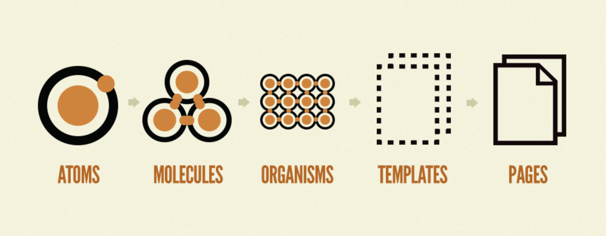

# Components

Nextjs.ai is working on creating a set of highly accessible Components that can be used in any Next.js project. \
\
Components will use [react-aria ](https://react-spectrum.adobe.com/react-aria/react-aria-components.html)as a base.

These components are built with React Server Components and provide a fullstack solution for building accessible AI powered web apps.

All components will allow you to either provide a resolver to make API calls yourself or by default it will use window.io and allow the user to pick their model.

We will try to create equivalents for each gradio component. [https://gradio.app/docs/](https://gradio.app/docs/)

Components are organized using an [atomic design](https://atomicdesign.bradfrost.com/chapter-2/)

<figure><figcaption></figcaption></figure>

If you have any questions or suggestions, please reach out to us in our [Discord](https://discord.gg/2F2bHSma) or [Twitter](https://twitter.com/nextjs\_ai).
